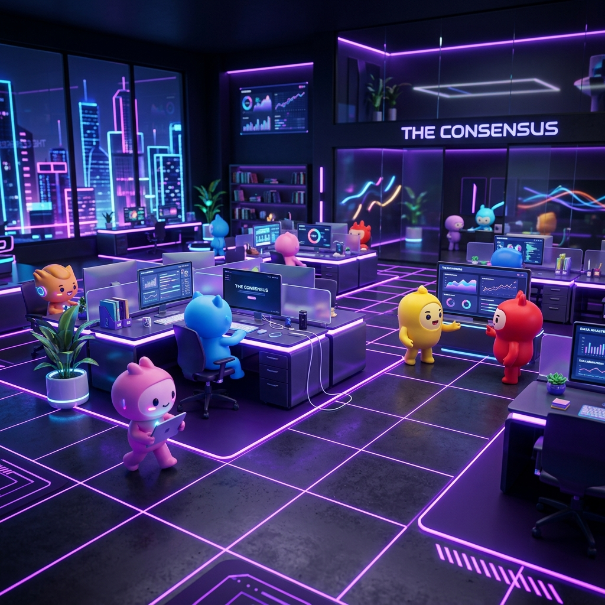

<p align="center">
  
</p>

<p align="center">
  <a href="https://github.com/StarDust-Git-Code"><b>Launch The Consensus · Full Experience *</b></a>
</p>

> [!IMPORTANT]
> **\*** This experience requires **BYOK (Bring Your Own Key)**. You will need a **[Gemini API key](https://aistudio.google.com/app/apikey)** to run the simulation. Deep integration enables native support for text, and multimodal generation (**Imagen 3**, **Lyria 3**, **Veo 3.1**). You can also **clone or fork** this repository to run it locally.

<br/>

## 🏆 PIXEL.GEMINI 2.0 Hackathon Submission

This project, **The Consensus**, is our official submission for the **PIXEL.GEMINI 2.0** hackathon organized by TRISHULX in collaboration with MLH!

- **Project Name:** The Consensus
- **Project Description:** A no-code 3D playground to explore, design, and interact with Agentic AI systems.
- **GitHub Repository Link:** [Repository Link](https://github.com/StarDust-Git-Code) *(Please update with exact repo URL)*
- **Demo Video or Screenshots:** *(Please add your YouTube/Drive demo video link here)*
- **Working Prototype/Application:** [Live Demo / Local Installation](#getting-started)
- **Google Gemini Integration:** The entire autonomous agent decision-making process, task delegation, and multimodal asset generation is deeply integrated with **Gemini 3.1 Pro (High)** and **Gemini 3 Flash**.

---

## What is The Consensus?

# A no-code 3D playground to explore, design, and interact with Agentic AI systems

This project is designed for **AI enthusiasts, educators, and creative developers** looking to understand multi-agent collaboration in a living 3D office without writing a single line of code.

## Getting Started

1. **Install dependencies:**

```bash
npm install
```

2. **Run the development server:**

```bash
npm run dev
```

3. **Open the app:** Navigate to the local URL shown in your terminal (usually `http://localhost:3000/the-consensus/`).

## Features

### Agentic AI System (v0.2.0)

- **Team Editor (React Flow):** Create your own [multi-agent design patterns](https://developers.googleblog.com/developers-guide-to-multi-agent-patterns-in-adk/) using an interactive node-based interface.
- **6 Predefined Teams:** Industry-specific templates (Creative Agency, Film Studio, PR Agency, etc.) to get you started.
- **Multimodal Outputs:** Generate professional assets including highly detailed markdown text, image, music (Lyria 3), and video (Veo 3.1) directly from your agent teams.
- **Markdown Deliverables:** Text-based agents now produce extensive, structured long-form markdown deliverables that can be easily downloaded via the UI.
- **Per-Agent LLM:** Assign different [Gemini Models](https://ai.google.dev/gemini-api/docs/models) to specific roles (e.g., Flash for speed, Pro for reasoning).
- **PR-style Workflows:** Learn about Pull Request and Review workflows where agents with `human-in-the-loop` properties require your approval to proceed.
- **Guardrails:** Controlled generation with the `Auto-approve output` option, ensuring quality before final asset production.
- **Technical Logs:** Improved visibility into raw LLM traces, tool calls, and structured agent responses.

### Embodied Simulation

- **Hybrid GPU/CPU Architecture:** A high-performance **3D simulation** built with **Three.js WebGPU** where autonomous LLM-powered characters collaborate in a shared physical workspace.
- **Intelligent Pathfinding:** NPCs utilize a NavMesh to navigate the office, finding and claiming specific "Points of Interest" (desks, seats, computers) based on their current task. Pathfinding is powered by [three-pathfinding](https://github.com/donmccurdy/three-pathfinding).
- **Dynamic State Machine:** Characters transition naturally between walking, sitting, working, and talking, with sync'ed 3D speech bubbles and expressions.

### Interactive UI

- **Team Flow Visualizer:** Real-time node-based view of your agent hierarchy and task flows.
- **Simulated PR Reviews:** Interactive modals for reviewing agent proposals, providing feedback, and merging tasks.
- **Real-time 3D Overlay:** Status indicators and interaction menus projected from 3D space into a polished UI.
- **Agent Inspector:** Select any agent to view their "thoughts", mission, and history.
- **Kanban & Action Logs:** Complete transparency into the agency's progress and tool-level interactions.

## Tech Stack Deep Dive

- **Engine:** [Three.js](https://threejs.org/) (WebGPU & TSL) for advanced rendering and compute.
- **UI:** [React](https://react.dev/) & [React Flow](https://reactflow.dev/) for node-based team visualization.
- **AI:** [Gemini API](https://deepmind.google/technologies/gemini/) is the core LLM provider.
- **State:** [Zustand](https://github.com/pmndrs/zustand) for a unified, reactive store across the 3D world and React UI.
- **3D Assets:** Custom models and animations rigged in [Blender](https://blender.org), using an instanced animation system.

## Roadmap

- **World Building**
    - [ ] **Office/3D Space Editor:** Drag-and-drop workspace layout and POI customization.
    - [ ] **Dynamic Environment:** Real-time prop generation and environment modification by agents.
- **Advanced Interactions**
    - [ ] **Advanced Embodied AI:** Deeper integration between agent reasoning and physical 3D world actions.
    - [ ] **Enhanced Animations:** Richer character expressions and more fluid, context-aware animations.
    - [ ] **Human-Agent Spatial Interaction:** Direct collaboration and richer multi-party interactions in the 3D office.
    - [ ] **Inter-Agent Knowledge Sharing:** Long-term memory for agent teams across projects.
- **Refinement**
    - [ ] **Architecture Decoupling:** Further separation of core logic from the simulation environment.

## Developer Note

This release (**v0.2.0**) was developed entirely using **Google Antigravity** as the primary IDE and powered by **Gemini 3.1 Pro (High)** and **Gemini 3 Flash**.

## License & IP

This project follows a dual-licensing model:

- **Source Code (MIT):** All logic, shaders, and UI code are free to use, modify, and distribute.
- **3D Models & Assets (CC BY-NC 4.0):** The custom 3D office and character models are Copyright © 2026. They are free for personal and educational use but _cannot_ be used for commercial purposes without permission.

Developed with ❤️ by [StarDust-Git-Code](https://github.com/StarDust-Git-Code) & [Firex-007](https://github.com/Firex-007)
